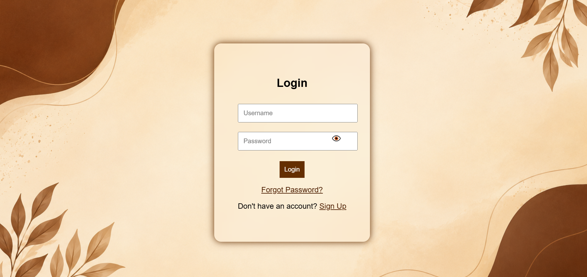

# 🔐 Login Page System

---

## 🚀 Overview

A simple, responsive and beginner-friendly Login & Authentication UI system built using HTML, CSS, and Vanilla JavaScript.  
It simulates a real-world authentication flow using LocalStorage without any backend.
This project focuses on frontend authentication logic and UI flow simulation using LocalStorage.

---

## 🌐 Live Demo

👉 https://rusaitharmkv.github.io/login-project/

---

## ✨ Features

- 👤 User Signup Page  
- 🔑 Login Authentication  
- 🔁 Forgot Password Flow  
- 🔒 Reset Password Page  
- 💾 LocalStorage-based data handling  
- 📱 Fully Responsive UI  
- ⚡ Clean and minimal design  

---

## 🛠️ Tech Stack

| Technology | Description |
|------------|-------------|
| HTML5 | Page structure |
| CSS3 | Styling and layout |
| JavaScript | Logic & authentication |

---

## 📷 Preview

---

## 📂 Project Structure

login-project/
│── index.html → Login Page
│── signup.html → User Registration Page
│── forgot.html → Forgot Password Page
│── reset.html → Reset Password Page
│── style.css → Styling
│── script.js → JavaScript Logic
│── login.png → Preview Image

---

## 🎯 What I Learned

- DOM manipulation using JavaScript  
- Form validation techniques  
- LocalStorage usage  
- Multi-page frontend flow  
- UI structuring and responsiveness  

---

## 🚀 Future Improvements

- Backend authentication (Node.js / Firebase)  
- Database integration  
- JWT-based login system  
- Password encryption  
- Better UI animations  

---

## 👨‍💻 Author

**Rusaitha Mol KV**  
📧 Email: rusaitharmkv2005@gmail.com  
🌐 GitHub: https://github.com/rusaitharmkv  

---

## ⭐ Support

If you like this project, consider giving it a ⭐ on GitHub!

---

## 📌 Note

This project is built for learning purposes and frontend practice.
